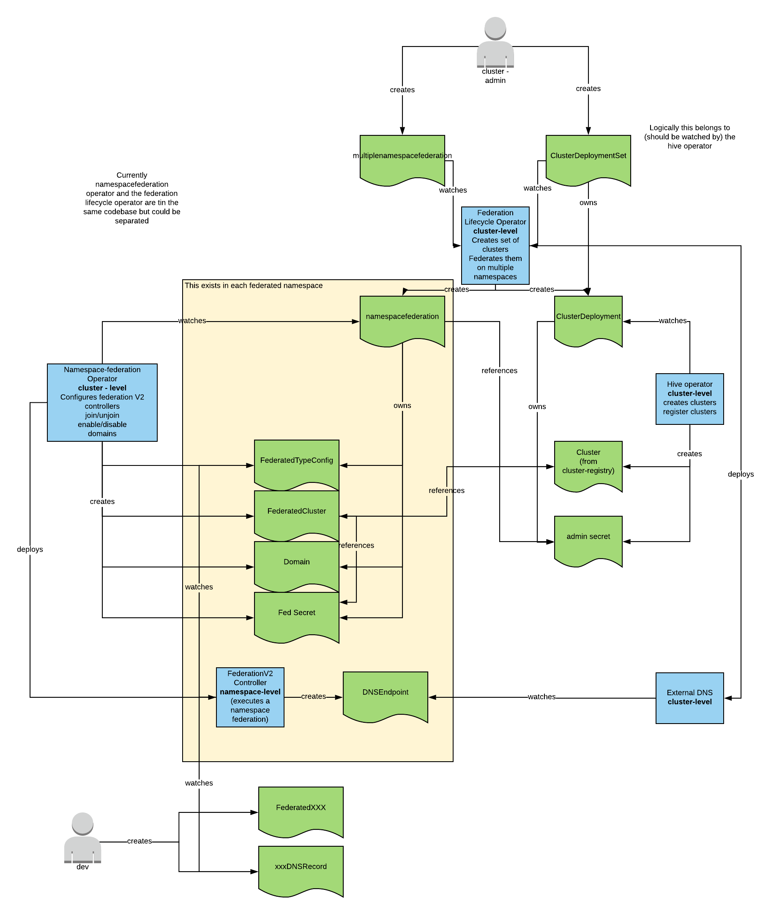

# Federation Lifecycle Operator

[](https://travis-ci.org/raffaelespazzoli/federation-lifecycle-operator) [](https://quay.io/repository/raffaelespazzoli/federation-lifecycle-operator)

This operator attends to the entire lifecyle of federating clusters:

1. [Creating Multiple Clusters](#Creating-Multiple-Clusters)
2. [Federating Clusters on a Single Namespace](#Federating-Clusters-on-Single-Namespace)
3. [Federating Clusters on Multiple Namespaces](#Federating-Multiple-Namespaces)
4. [Support for Global Load Balancer](#Adding-a-Global-Load-Balancer)

Run a demo following these [instructions](./DEMO.md)

The below diagram shows the relations between the involved controllers and CRDs



This operator packages a few controllers that are explained below:

## Creating Multiple Clusters

Here we have a controller to create a set of clusters with the intention of federating them.

To do so, we leverage [Hive](https://github.com/openshift/hive), which is an operator that manages the creation of clusters via the `ClusterDeployment` CRD.

We add a new CRD called `ClusterDeploymentSet`, which can be used to declare the intention of creating a set of clusters. Here is an example:

```yaml
- apiVersion: federation.raffa.systems/v1alpha1
  kind: ClusterDeploymentSet
  metadata:
    name: ${CLUSTER_NAME}
  spec:
    replicas: 3
    ensureNoOverlappingCIDR: true
    regions:
    - us-west-1
    - us-east-2
    - us-east-1
    registerClusters: true  
    template:
      ...
here you have ClusterDeployment fields, documented in the hive project
```

`regions` determines in which regions the clusters will be created. The first cluster is created in the first region and so on. When there are no more reqions, we go back to the first region in an endless loop.

`ensureNoOverlappingCIDR`, makes sure that the machine, service and SDN CIDRs of the clusters do not overlap. This can be useful of you plan to create network tunnels between the clusters. A bit of math should be taken into account here, because if the CIDRs are too big and there are too many clusters you might run out of IPs at which point the controller will error out.

`registerCluster` will make the controller register the newly create cluster as a `clusterregistry.Cluster`. Notice the new resource will be created in the same namespace as the ClusterDeploymenetSet. This prevents name collision and guaratees garbage collection.

## Federating Clusters on Single Namespace

This controller automates the federation of a single namespace across multiple clusters.

Underneath it uses [Federation V2](https://github.com/kubernetes-sigs/federation-v2) scoped to a single namespace.

A NamespaceFederation CR looks as follows:

```yaml
apiVersion: federation.raffa.systems/v1alpha1
kind: NamespaceFederation
metadata:
  name: test-namespacefederation
spec:
  clusters:
  - name: raffa2
    adminSecretRef:
      namespace: kube-multicluster-public
      name: admin-raffa2
  federatedTypes:  
  - kind: Route
    apiVersion: route.openshift.io/v1
  domains:
  - mydomain.com  
```

The namespace that is going to be federated is the same namespace in which the CR is created.

The clusters that are going to be federated are sepcified in the `clusters` array field. An admin secret reference, which contains a kubeconfig file configured to operate on the to-be-federated cluster, must also be provided. The account in the kubeconfig file must have enough permissions, likely it needs to be admin.

The resource types that will be federated are listed in the `federaredTypes` array field. By default only the federated namespace type is created as it is always needed. It must not be added to the array.

The `domains` field is where you can specify the domains valid for this federation. This filed has an actual effect only if the global loadbalancer is also installed (see below)

### Prequisite to federating a cluster

In order for a cluster federation to succeed the following is needed:

1. the cluster is created, reachable and functioning
2. the cluster is inventoried in the cluster registry.

    you can add a new cluster by creating an object like this:

    ```yaml
    apiVersion: clusterregistry.k8s.io/v1alpha1
    kind: Cluster
    metadata:
      name: raffa2
    spec:
      kubernetesApiEndpoints:
        serverEndpoints:
        - serverAddress: console.raffa2.casl-contrib.osp.rht-labs.com:8443
          clientCIDR: "0.0.0.0/0"
        caBundle: LS0tLS1CRUdJTiBDRVJUSUZJQ0FURS0tLS0tCk1JSUM2akNDQWRLZ0F3SUJBZ0lCQVRBTkJna3Foa2lHOXcwQkFRc0ZBREFtTVNRd0lnWURWUVFEREJ0dmNHVnUKYzJocFpuUXRjMmxuYm1WeVFERTFOVEF6TlRNNE56QXdIaGNOTVRrd01qRTJNakUxTVRBNVdoY05NalF3TWpFMQpNakUxTVRFd1dqQW1NU1F3SWdZRFZRUUREQnR2Y0dWdWMyaHBablF0YzJsbmJtVnlRREUxTlRBek5UTTROekF3CmdnRWlNQTBHQ1NxR1NJYjNEUUVCQVFVQUE0SUJEd0F3Z2dFS0FvSUJBUURMZ0JFV2lHMGtrZWZqRVR2SEpxL2IKNEpxK3pOZ0R4dVRpTWVqU3c0N1ZKbEUvM1Uxc29WMisyd29lVkZSZEFyY3JEdnZ3OU55dk9HZkFCQ0pUbTI0cAp3MlNkdlBFZ1F2Z2RtbHM5andsV2o2MnA5UCtmNGJmVkhBbUJzU3JVTklKaHdlMEQyaEViVDhRQnRUWDVDRTVlCitmays5dWZsVDJHRUZSaVp4Q09SNG9IZEJ3V0Uwekg4bFFFRXBSOERmVGp1djZxL3krVkdlejVzL0ZWYnFSNVUKMmJsWW9BdmV2K2VqYnFwSllDSjhrRFY5ajkzeWJRZUFScWxyVEd5V3d0VnhxaDYveFFFZXJNNGR0WlB2Sk9FWQpvUEpuRUhQNlRhNFhUdklCNStEMiszTU02c3B2elRYWnhReHdPNWZ3RW9jZVlCTUhDOC91UGhFTHlLMTh6cks1CkFnTUJBQUdqSXpBaE1BNEdBMVVkRHdFQi93UUVBd0lDcERBUEJnTlZIUk1CQWY4RUJUQURBUUgvTUEwR0NTcUcKU0liM0RRRUJDd1VBQTRJQkFRQzM0TFZ4ZlJlTkNYUVR3amxnVUxwdW5pM3BHdTdtdUlxVytVSlBkNjBSaHlLTwpZNXRVRTQ1NEM2SHZDOVhYeGlGSDBHSnlpdW1TTGFlMUdwTkc5djJTaWR5R1BGMjJId1BzSm9uU1F6aTUwc1lpCkJvc2ZzZnUrWTExbEZKbS9xSzBhZU9iUGVKTkVqQngzT3VKRXRSQXFPOC9sTXR3UlErKzU1SHUyQ2tEc00rWGEKUXhsNHF4cHpiMWI3MmZ0SmNqdW9tRlNRU1lhNWJ6WW5peUZYTUZCcW94SUx6Q2M5dFZha3loTTc2Yi9QWTJvNgpBdU90TXcwMnpaM1diL1Vuck9tSjI5VldGTEx0VDF3Wmsrakt2SFhwbE9FbTQrVklkZHNsZ0M5RnJVT1BuNTh1CmhtZHpnbGtsRmw5b0ZQOURhdU80Qm1sMEdGb2dGazJiVFFyWmlzVTkKLS0tLS1FTkQgQ0VSVElGSUNBVEUtLS0tLQo=
    ```

3. A secret containing a kubeconfig with admin privileges is created and cofigured in the NamespaceFederation CR.

    you can create such a secret as follows:

    ```shell
    oc --config ./test/kubeconfig login <cluster-url> -u <admin-username> -p <admin-password>
    oc create secret generic admin-raffa2 --from-file=./test/kubeconfig -n kube-multicluster-public
    oc apply -f ./test/cluster.yaml -n kube-multicluster-public
    ```

## Federating Multiple Namespaces

You can also federate multiple namespaces at the same time. In order to do that a different CRD is provided. Here is an example:

```yaml
apiVersion: federation.raffa.systems/v1alpha1
kind: MultipleNamespaceFederation
metadata:
  name: test-multiplenamespacefederation
spec:
  namespaceFederationSpec:
    clusters:
    - name: raffa2
      adminSecretRef:
        namespace: kube-multicluster-public
        name: admin-raffa2
    federatedTypes:  
    - kind: Route
      apiVersion: route.openshift.io/v1
    domains:
    - mydomain.com
  namespaceSelector:
    matchLabels:
      federation: raffa
```

When this CR is created the controller will create the corresponding NamespaceFederation CRs in the selected namespaces.

## Adding a Global Load Balancer

A global load balancer allows sending traffic to application exposed by the federated clusters.
This fetaure is provider by [external-dns](https://github.com/kubernetes-incubator/external-dns).
You need to own a domain in order to use this feature.
Two types of global load balancers are supported:

1. `Cloud-Provided`. If you are running on a cloud provider most times it makes sense to use the cloud provider global load balancer service.
2. `Self-Hosted`. With this option the global load balancer will be installed in teh federated clusters.

Here is an example of a CR using the cloud-provided gloabal loadbalancer:

```yaml
apiVersion: federation.raffa.systems/v1alpha1
kind: MultipleNamespaceFederation
metadata:
  name: test-multiplenamespacefederation
spec:
  namespaceFederationSpec:
    clusters:
    - name: raffa2
      adminSecretRef:
        namespace: kube-multicluster-public
        name: admin-raffa2
    federatedTypes:  
    - kind: Route
      apiVersion: route.openshift.io/v1
    domains:
    - mydomain.com
  namespaceSelector:
    matchLabels:
      federation: raffa
  globalLoadBalancer:
    type: cloud-provided
    provider: aws
```

Here is an example of a CR using the self-hosted gloabal loadbalancer configuration:

```yaml
apiVersion: federation.raffa.systems/v1alpha1
kind: MultipleNamespaceFederation
metadata:
  name: test-multiplenamespacefederation
spec:
  namespaceFederationSpec:
    clusters:
    - name: raffa2
      adminSecretRef:
        namespace: kube-multicluster-public
        name: admin-raffa2
    federatedTypes:  
    - kind: Route
      apiVersion: route.openshift.io/v1
    domains:
    - mydomain.com
  namespaceSelector:
    matchLabels:
      federation: raffa
  globalLoadBalancer:
    type: self-hosted
    controllerURL: <master-url of this cluster>
```

## Installation

The following steps are needed to deploy this operator

Create the needed CRDs

```shell
find ./crds -type f -name "*.yaml" | xargs -n 1 oc apply -f
find ./deploy/crds/ -type f -name "*_crd.yaml"  | xargs -n 1 oc apply -f
oc new-project federation-lifecycle-operator
oc create configmap templates --from-file templates/federation-controller/federation-controller.yaml --from-file templates/federated-cluster/federated-cluster.yaml --from-file templates/remote-federated-cluster/remote-federated-cluster.yaml --from-file templates/federated-types/federated-types.yaml --from-file templates/globaldns/cpglobaldns.yaml --from-file templates/globaldns/shglobaldns.yaml --from-file templates/globaldns/globaldns-sa.yaml -n federation-lifecycle-operator
oc apply -f deploy -n federation-lifecycle-operator
```

## Development

Download the dependencies:

```shell
dep ensure
```

Run the operator locally:

```shell
export FEDERATION_CONTROLLER_TEMPLATE=$GOPATH/src/github.com/raffaelespazzoli/federation-lifecycle-operator/templates/federation-controller/federation-controller.yaml
export FEDERATED_CLUSTER_TEMPLATE=$GOPATH/src/github.com/raffaelespazzoli/federation-lifecycle-operator/templates/federated-cluster/federated-cluster.yaml
export REMOTE_FEDERATED_CLUSTER_TEMPLATE=$GOPATH/src/github.com/raffaelespazzoli/federation-lifecycle-operator/templates/remote-federated-cluster/remote-federated-cluster.yaml
export FEDERATED_TYPES_TEMPLATE=$GOPATH/src/github.com/raffaelespazzoli/federation-lifecycle-operator/templates/federated-types/federated-types.yaml
export CLOUD_PROVIDER_GLOBALLOADBALANCER_TEMPLATE=$GOPATH/src/github.com/raffaelespazzoli/federation-lifecycle-operator/templates/globaldns/cpglobaldns.yaml
export SELF_HOSTED_GLOBALLOADBALANCER_TEMPLATE=$GOPATH/src/github.com/raffaelespazzoli/federation-lifecycle-operator/templates/globaldns/shglobaldns.yaml
export SERVICE_ACCOUNT_GLOBALLOADBALANCER_TEMPLATE=$GOPATH/src/github.com/raffaelespazzoli/federation-lifecycle-operator/templates/globaldns/globaldns-sa.yaml
export WATCH_NAMESPACE=""
export OPERATOR_NAME=federation-lifecycle-operator/
go run "/home/rspazzol/go/src/github.com/raffaelespazzoli/federation-lifecycle-operator/cmd/manager/main.go"
```
